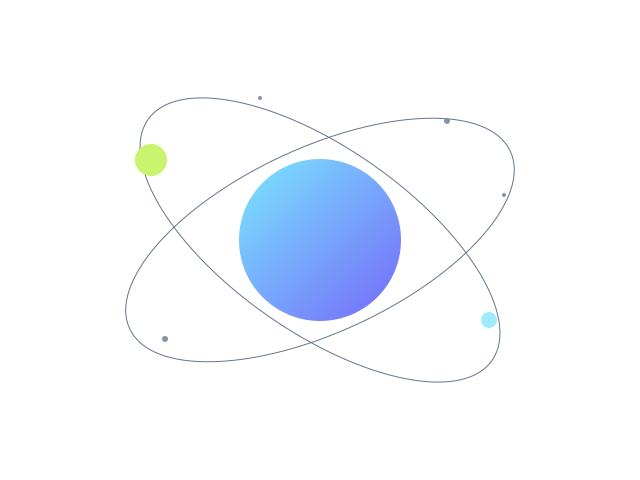

# SVG Motion Lab

**Anime seu SVG no navegador e exporte código para usar no seu site.**

Um editor visual para experimentar movimentos em ilustrações vetoriais, com processamento local, preview controlável e exportação de CSS ou JavaScript.

**[Abrir o editor](https://svgmotion.franklem.com/editor/)** · **[Experimentar um exemplo](https://svgmotion.franklem.com/editor/?exemplo=orbita)** · **[Ler os guias](https://svgmotion.franklem.com/guias/animacao-svg/)**



**Versão:** 0.3.0 — beta  
**Autoria:** Franklin Martins  
**Site:** [svgmotion.franklem.com](https://svgmotion.franklem.com/)

## Sobre este repositório

Este repositório contém os **arquivos estáticos de produção**, prontos para hospedagem. A branch `master` é usada pelo deploy automático configurado na Hostinger.

O código-fonte React/TypeScript, os testes e os scripts de build permanecem no projeto de desenvolvimento e **não estão incluídos aqui**. Por isso, comandos como `npm ci`, `npm run dev` e `npm run build` não se aplicam a este repositório.

## Recursos

- Importação de SVG por arquivo ou arrastar e soltar, com sanitização e relatório de remoções.
- Seleção de elementos no desenho ou na lista de camadas.
- Cinco canais: deslocamento X e Y, rotação, escala uniforme e opacidade.
- Presets editáveis: **Fade In, Slide, Pulse, Spin e Bounce**.
- Ajustes de pivô, duração, atraso, easing, direção e repetição.
- Timeline com reprodução, pausa, reinício e seleção de um instante.
- Desfazer/refazer, salvamento local e importação/exportação de projeto JSON.
- Exportação de pacotes ZIP com CSS ou JavaScript usando Web Animations API.
- Temas claro/escuro, atalhos e interface móvel por abas.
- PWA com uso offline após o carregamento inicial e cache concluído.
- Três exemplos originais e guias em português.

## Crie sua primeira animação

1. [Abra o editor](https://svgmotion.franklem.com/editor/) e importe um SVG ou escolha um exemplo.
2. Revise o relatório de importação antes de aceitar a versão sanitizada.
3. Selecione uma forma e aplique um preset.
4. Ajuste os valores, o pivô e o tempo. O preview começa pausado.
5. Use a timeline para conferir diferentes instantes.
6. Baixe o JSON para continuar a edição depois ou exporte um pacote CSS/JavaScript.

O **loop do preview** repete a janela da timeline. A repetição incluída no arquivo exportado é definida nas propriedades de cada elemento.

## Exportações

| Formato | Conteúdo | Finalidade |
| --- | --- | --- |
| CSS | `animation.svg`, `animation.css`, `index.html` e `README.txt` | Integrar com CSS keyframes |
| JavaScript | Os arquivos acima e `animation.js` | Controlar animações com Web Animations API |
| Projeto | `nome.sml.json` | Guardar um backup e retomar a edição |

Use o SVG **inline no HTML**, como na demonstração exportada. O arquivo `animation.svg` é uma cópia de apoio; não é uma animação autônoma para uso em ``.

O pacote JavaScript funciona sem React e expõe `initAnimation(container)`, com os controles `play`, `pause`, `restart` e `dispose`. Os pacotes incluem tratamento para preferência por movimento reduzido.

## Privacidade e salvamento

SVGs e projetos são processados no navegador, sem envio de seu conteúdo a um servidor. O editor não possui contas, backend de projetos, anúncios ou analytics.

- **IndexedDB:** sessão atual e uma versão anterior para recuperação.
- **localStorage:** preferências pequenas, como tema e larguras dos painéis.
- **Service worker:** cache dos arquivos públicos da aplicação para uso offline.

Autosave não substitui backup: o navegador ou o sistema podem apagar dados locais. Baixe o JSON regularmente. Para remover a sessão e as preferências, abra **Ajuda → Apagar dados deste dispositivo**.

Saiba mais na [página de privacidade](https://svgmotion.franklem.com/privacidade/).

## Formato suportado e limites

O editor aceita formas básicas, grupos, paths, texto e gradientes locais dentro de um subconjunto restrito de SVG.

| Recurso | Limite |
| --- | --- |
| SVG de entrada | 1 MiB |
| Projeto JSON | 3 MiB |
| Elementos XML | 1.000 |
| Profundidade | 32 níveis |
| Elementos animados | 100 |
| Offsets por alvo | 16 |

Scripts, eventos, CSS importado, imagens, links, referências externas, filtros, máscaras, recortes, `use` e animações SMIL não são suportados. Sua remoção pode alterar a aparência do desenho.

A beta não oferece edição vetorial, morphing, movimento sobre trajetórias, exportação GIF/MP4/Lottie, colaboração ou armazenamento em nuvem. Também não permite animar um grupo e seu descendente simultaneamente.

Consulte o [guia de SVG seguro](https://svgmotion.franklem.com/guias/svg-seguro/) antes de importar ilustrações complexas.

## Executar esta versão localmente

Para visualizar os arquivos deste repositório, use um servidor HTTP estático. Exemplo com Git e Python 3 instalados:

```sh
git clone https://github.com/franklinlem/svg-motion-lab-0.3.0-static.git
cd svg-motion-lab-0.3.0-static
python3 -m http.server 8080 --bind 127.0.0.1
```

Abra [localhost:8080](http://localhost:8080/) ou [localhost:8080/editor/](http://localhost:8080/editor/).

Esse servidor simples não aplica as regras de `.htaccess`. Abrir o HTML diretamente por `file://` não substitui o teste via HTTP.

## Estrutura dos arquivos

```text
index.html                Página inicial
editor/index.html         Editor
assets/                   JavaScript e CSS compilados
examples/                 SVGs originais de demonstração
guias/                    Guias com HTML estático
privacidade/              Política de processamento e armazenamento
sobre/                    Informações do projeto
manifest.webmanifest      Manifest da PWA
sw.js                     Service worker
robots.txt                Regras de rastreamento
sitemap.xml               URLs públicas canônicas
404.html                  Página de erro
.htaccess                 Headers, cache e configuração da hospedagem
```

## Publicação

O domínio de produção é **https://svgmotion.franklem.com/**. O site usa canonical e metadados próprios por página, [robots.txt](https://svgmotion.franklem.com/robots.txt) com indexação permitida e [sitemap.xml](https://svgmotion.franklem.com/sitemap.xml) com nove URLs públicas. A página 404 permanece com `noindex`.

Atualizações da branch `master` acionam o deploy automático configurado na Hostinger. Para novas versões:

1. Gere os artefatos no projeto de desenvolvimento com o domínio correto.
2. Atualize os arquivos deste repositório, incluindo arquivos ocultos como `.htaccess`.
3. Mantenha os assets antigos durante a transição de clientes com a PWA aberta.
4. Confira o conteúdo efetivamente servido no domínio após o deploy.

Para alterar a aplicação, trabalhe no código-fonte e gere outro build. Evite editar diretamente os bundles compilados em `assets/`.

## Validação da beta

Na implementação da versão 0.3.0 foram aprovados:

- 16 testes unitários.
- 33 testes E2E em Chromium, Firefox e WebKit.
- TypeScript, lint e build.
- Fluxos de importação segura, exportação independente, recuperação local, uso offline e atualização da PWA.
- Auditoria automatizada de acessibilidade dos cenários testados nos dois temas.

Esses testes foram executados no projeto de desenvolvimento e não estão disponíveis neste repositório estático. Não substituem homologação em Safari/iOS e Chrome/Android reais, revisão manual integral de acessibilidade ou medições de desempenho em produção.

## Guias

- [Seu primeiro SVG animado](https://svgmotion.franklem.com/guias/animacao-svg/)
- [CSS keyframes](https://svgmotion.franklem.com/guias/css-keyframes/)
- [Easing](https://svgmotion.franklem.com/guias/easing/)
- [Web Animations API](https://svgmotion.franklem.com/guias/web-animations-api/)
- [SVG seguro](https://svgmotion.franklem.com/guias/svg-seguro/)

## Autoria e licença

Projeto de **Franklin Martins**. Órbita, Decolar e Geometria são exemplos criados para o SVG Motion Lab.

A licença de distribuição do projeto ainda não foi definida. A disponibilidade pública deste repositório não representa uma concessão de licença MIT ou outra licença open source. SVGs importados pelos usuários continuam sujeitos aos direitos de seus respectivos autores.
